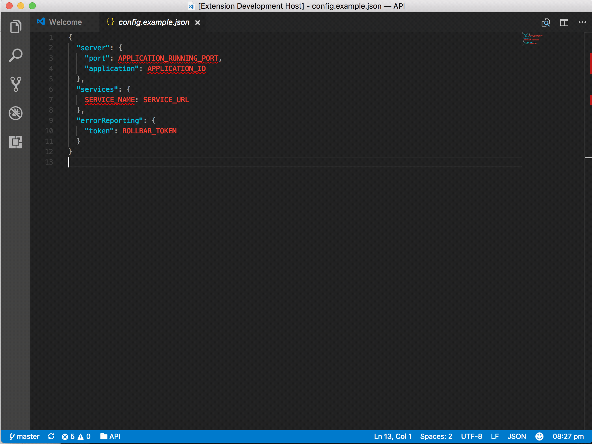

# VSCode | Can I Use
[](https://marketplace.visualstudio.com/items?itemName=yahya-gilany.vscode-canIuse)

"Can I use" provides up-to-date browser support tables for support of front-end web technologies on desktop and mobile web browsers.

## Installation

Press F1 in VSCode, type 
```
ext install vscode-caniuse
```

## Usage


## Extension Settings

This extension contributes the following settings:
- **Nothing so far**
## Known Issues

Please Report any issue to the Git repository.

Please feel free to file new issues and submit pull requests to resolve any issue you may have.


## Release Notes

please refer to the change log CHANGELOG.md

**Enjoy!**

## License

MIT © Yahya Gilany
